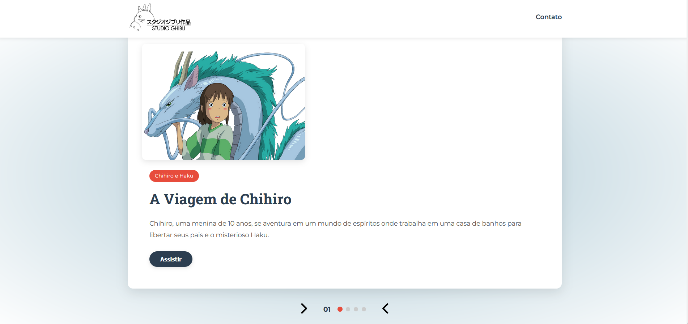

# Site_Studio-Ghibli
# README - Projeto Studio Ghibli

## 📌 Visão Geral
Um carrossel interativo com os principais personagens e filmes do Studio Ghibli.

## ✨ Funcionalidades
- **Carrossel interativo** com navegação por setas e indicadores
- **Design responsivo** que se adapta a diferentes telas
- **Botões "Assistir"** com links para a Netflix

## 🛠 Tecnologias Utilizadas
- HTML5 semântico
- CSS3 
- JavaScript

  
